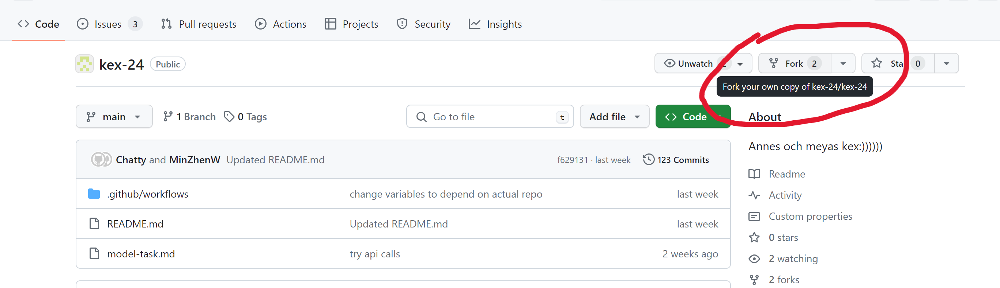
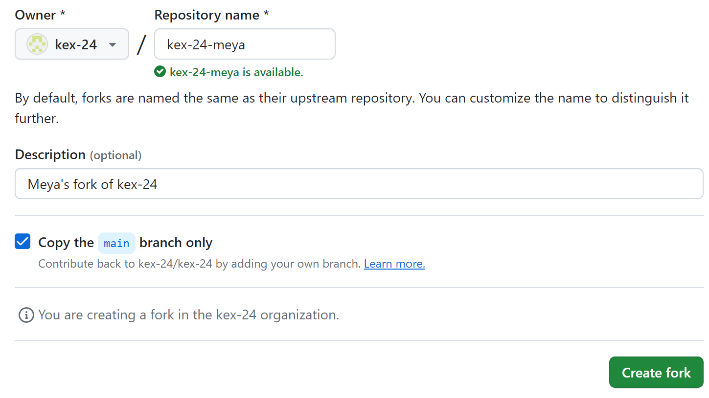
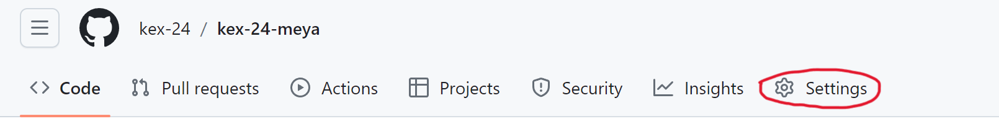
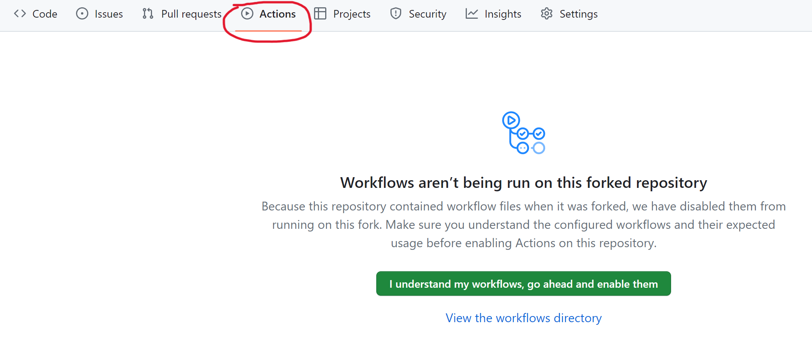
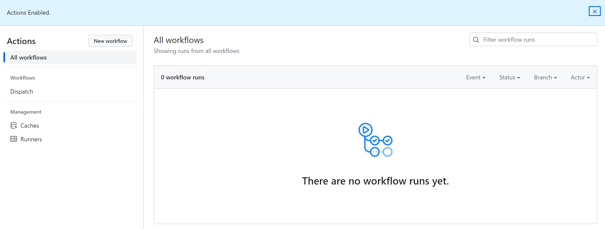

# Anne Haaker och Meya Wikner's KEX 2024

This repo makes use of openAI's LLM ChatGPT for generating personalized programming tasks. Using Github actions the user creates an issue with the subject line as the desired theme of the task. Actions then dispatches an API query with the model task and theme. The result is commited to `gpt-task.md`

## Step-by-step

### 1. Fork the repo

### 2. Forked repo-settings

- [ ] Make `kex-24` the repo-Ownner
- [ ] Select an available Repository name

### 3. Enable issues in the forked repo

- Enter Settings
- Scroll down to "Features"
- Check the box next to "Issues", enabling issues

### 4. Enable Github Actions

Press the green button "I undestand my workflows, go ahead and enable them" to enable Github Actions.

### 5. Workflows should now be on!

To start generating, open a new issue with a desired theme!